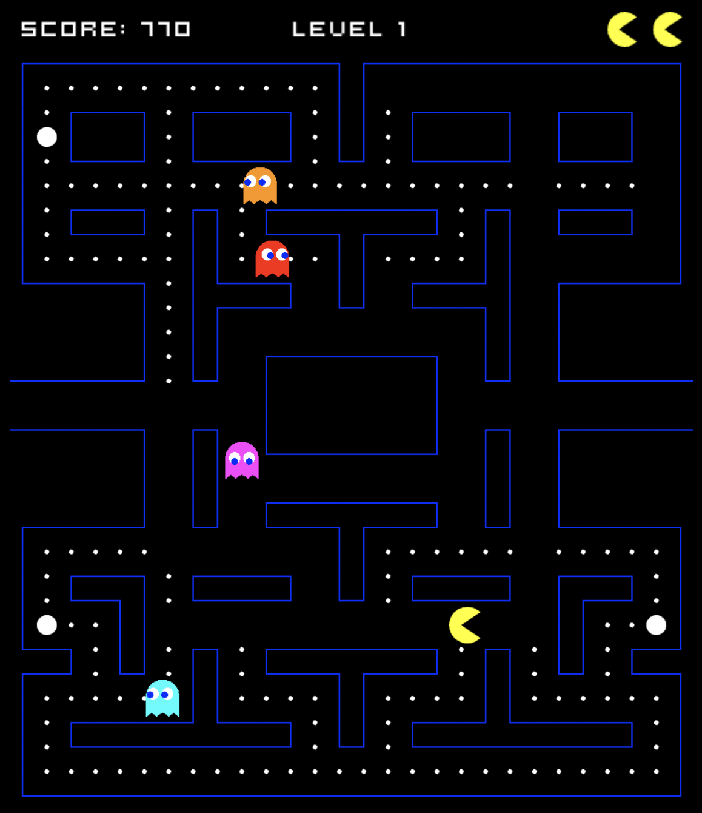

#  Pac-Man Client     &nbsp;&nbsp;&nbsp;&nbsp;&nbsp;&nbsp; 

This repository is the client React application for my solo Pac-Man project. Players can visit the live site and click play. Upon which the game will load with similar rules to the original Pac-Man where the player has to score as many points as they can while avoiding the ghosts that roam the board. This client connects to a backend server to display high scores made by other players on a leaderboard when all their lives run out and the game is over. The player can sign up and make an account themselves for their score to also be saved in the database.

The SolidJS version of this app (in progress) can be found at https://github.com/jmcnally17/pacman-client-solid

This app pairs with an API that has multiple versions: <br>
JS API (deployed version): https://github.com/jmcnally17/pacman-api-js <br>
Java API: https://github.com/jmcnally17/pacman-api-java

The original project monolith (with a full comprehensive commit history) can be found at https://github.com/jmcnally17/pacman-old

[](https://projectpacman.netlify.app)

### Technologies Used

- [React](https://reactjs.org/) as a web framework
- [Node.js](https://nodejs.org/en/) for the server runtime environment
- [HTML5 Canvas](https://www.w3schools.com/html/html5_canvas.asp) as a container for the graphics
- [React Testing Library](https://testing-library.com/docs/react-testing-library/intro/) for testing
- [Pexels Draw](https://apps.apple.com/us/app/pexels-draw/id1320744895?mt=12) for creating the boundary images and ghost sprites
- [Netlify](https://www.netlify.com/) for deployment
- [GitHub](https://github.com/) for version control

A huge thank you to [Chris Courses](https://www.youtube.com/c/ChrisCourses) YouTube channel for his tutorial which helped with some of the basic game mechanics. Link to the tutorial video can be found [here](https://youtu.be/5IMXpp3rohQ).

Another thank you to [Stuart McNally](https://github.com/Stew2134) for remastering all the audio using [Ableton Live 11](https://www.ableton.com/en/live/).

## Gameplay

The player can use the directional keys to move Pac-Man within the boundaries around the board. The four ghosts will periodically cycle through scattering and chasing Pac-Man and will move randomly while in their scared state or retreating state. For mobile and tablet users who don't have a keyboard, a D-pad is displayed under the game board that they can click which trigger keyboard events for arrow keys.

### Rules

- Pac-Man starts off with 2 extra lives
- Eating 1 pellet is worth 10 points
- Eating every pellet completes the current level
- After completing a level, the board is reset to its original configuration, except for Pac-Man's lives and the player's score
- Eating 1 power up is worth 50 points
- Eating a power up scares all unscared ghosts which halves their speed and lasts for a specific duration that depends on the level number
- Eating a power up has no effect on scared ghosts other than restarting the scared phase
- Colliding with a scared ghost sends the ghost into retreating mode for 3 seconds and is worth $2^n \cdot 200$ points where n is the number of scared ghosts attacked since the last power up was eaten
- Colliding with a ghost that is not scared decreases Pac-Man's lives by 1 and resets character positions on the board
- Colliding with a ghost that is not scared when Pac-Man has no extra lives left ends the game

<p align="center">
  
</p>

<p align="center">
  <b>Fig.1 -</b> A screenshot of some gameplay with Pac-Man collecting pellets while avoiding the ghosts. The game stats can be seen at the top
</p>

## Running Locally

This app can be run on your localhost. However, a number of frameworks need to be installed which requires some setup to do.

### Getting Started

This client application is run using Node.js, which is installed using NVM - Node Version Manager. So if you haven't already, open your terminal and install NVM using:

```
curl -o- https://raw.githubusercontent.com/nvm-sh/nvm/v0.39.1/install.sh | bash
```

Now, your ~/.zshrc file will need reloading:

```
source ~/.zshrc
```

Next, you can install and start using node by running:

```
nvm install node
nvm use node
```

`nvm use node` will use the latest stable version.

### How To Use

Now, you can clone this repository:

```
git clone https://github.com/jmcnally17/pacman-client-react.git
```

The dependencies must be installed by running `npm install` while in the [main](https://github.com/jmcnally17/pacman-client-react) directory.

Now you can run this app by entering `npm start` while in the [main](https://github.com/jmcnally17/pacman-client-react) directory and then visit http://localhost:8000 in your browser to play the game.

In order to play with full functionality, you must also be running the backend server alongside this client (link to that repo found at the top of this README).

## Testing

Tests can be run while in the [main](https://github.com/jmcnally17/pacman-client-react) directory by running `npm test`. Code coverage statistics can be obtained by running `npm run test:coverage`. Tests were written first in order to adhere to the test-driven development (TDD) process by following the red-green-refactor cycle.

## Create React App

This project was bootstrapped with [Create React App](https://github.com/facebook/create-react-app).
